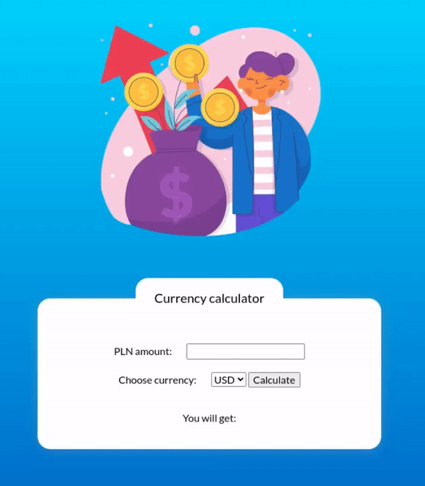

# Currency Calculator

[Demo] https://aknop07.github.io/currency-converter/

The Currency Calculator App is a user-friendly web application that allows users to quickly and accurately convert Polish Zloty to different currencies. With a clean and intuitive interface, this app makes currency conversion effortless.

$~$

## Design and Layout:
The app's design follows the Block Element Modifier (BEM) convention, ensuring a modular and maintainable code structure. The layout is responsive and adapts seamlessly to various screen sizes, making it accessible from desktops, tablets, and mobile devices.

$~$

## User Interface:
The user interface is visually appealing and highly intuitive, providing a seamless experience. The app consists of two input fields: one for the amount to be converted and another for selecting the source currency. A clear and prominent "Convert" button triggers the currency conversion process.

$~$

## Currency Conversion:
Behind the scenes, the app utilizes JavaScript to perform real-time currency conversion. It uses fixed exchange rates and uses this data to calculate the converted amount based on the user's inputs.

$~$

## Results Display:
Once the conversion is complete, the app displays the converted amount in a prominent and easily readable format. The results are presented clearly, with the source currency, target currency, and the calculated converted amount all visible to the user.

$~$

## Error Handling:
To enhance usability, the app includes error handling mechanisms. It validates user inputs, ensuring that the amount to be converted is a valid numerical value. 

$~$

## Used in this project:
- HTML
- CSS with BEM convention
- JavaScript

